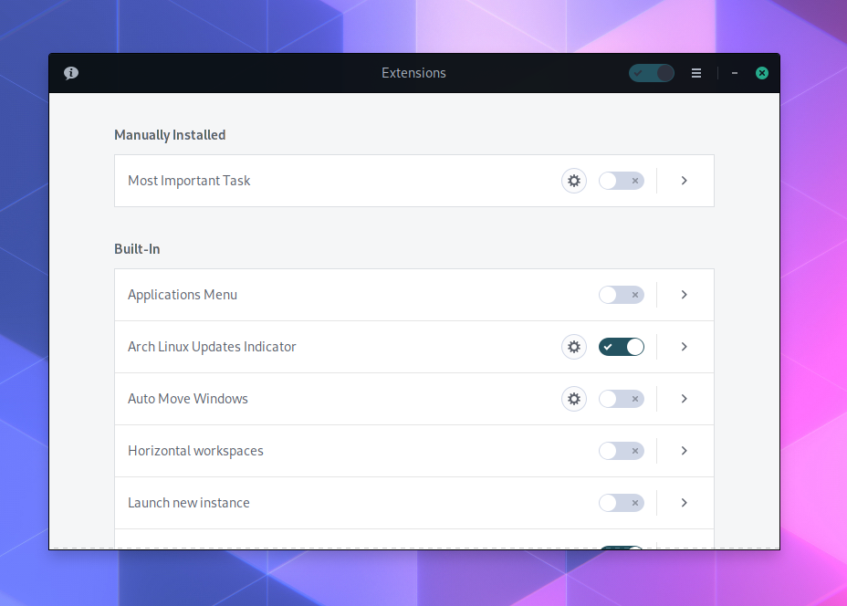
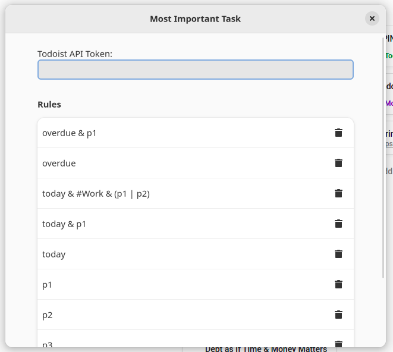

# Most Important Task - GNOME Shell Extension

## Installation


### Manual

```
$ mkdir -p ~/.local/share/gnome-shell/extensions/
$ git clone git@github.com:dukex/gnome-shell-most-important-task-extension.git ~/.local/share/gnome-shell/extensions/mit@emersonalmeida.wtf
```

## Usage

### Todoist

#### Setup your API token

1. Get the API Token
In [todoist.com/prefs/integrations](https://todoist.com/prefs/integrations) copy the value of **API token**

2. Open the **Extensions App* or the **GNOME Tweaks**



3. Configure the Most Important Task extension




#### Filters

To get the *most important task*, the task should:

- Has label "mit" and scheduled to today or be overdue (`@mit & (today | overdue)`)

Given the previous filter doesn't match any task, a new search will be made:

- Schedule to the next 7 days (`7 days`)

Given the previous filter doesn't match any task, a new search will be made:

- Assigned to you (`assigned to: me`)

## Screenshot


