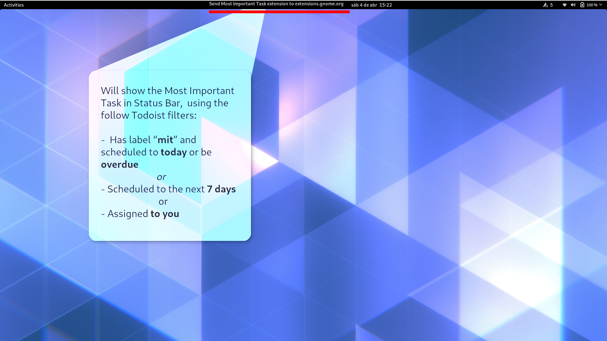

# Most Important Task - GNOME Shell Extension

## Screenshot




## Installation


### Manual

```
$ mkdir -p ~/.local/share/gnome-shell/extensions/
$ git clone git@github.com:dukex/most-important-task.git ~/.local/share/gnome-shell/extensions/mit@emersonalmeida.wtf
```

## Usage

### Todoist

#### Setup your API token

1. Get the API Token
In [todoist.com/prefs/integrations](https://todoist.com/prefs/integrations) copy the value of **API token**

2. Open the **Extensions App* or the **GNOME Tweaks**


3. Configure the Most Important Task extension


#### Rules

To get the *most important task*, you can set a prioritized rules, a rule can be any [Todoist Search filter](https://todoist.com/help/articles/introduction-to-filters)

To get an idea about rules, a good start can be:

- overdue & p1
- overdue
- today & p1
- today
- p1 & no date
- p2 & no date
- (p3 | p4) & no date